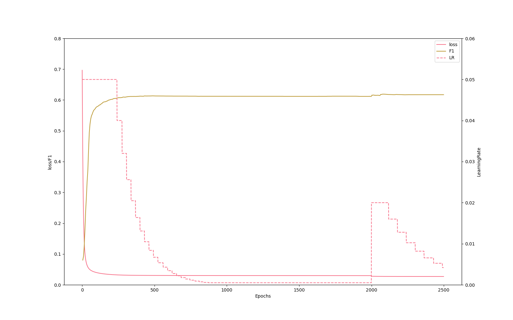

# 实验报告  

-------------------------

## 目的   
利用Softmax和预先产生的词向量完成命名实体识别的BIO多分类任务。  

-------------
## 环境与工具  
```text  
python 3.8.8  
pytorch 1.8.1  
numpy  
seaborn  
```  
--------------
## 源代码结构  
> 部分未在下文提到的部分为实验一相关的代码，为版本管理便利未移除。
 - `/soft_max.py`  
   调用工具类完成数据加载、数据格式化、模型训练与模型评估。  
 - `/utils`   
   工具类与工具函数  
   - `/utils/DataAgent.py`  
     文本数据加载、清洗、管理与生成模块。  
     - `class DataAgent`  
       从原始数据文件加载带标注的文本，进行初步分割与处理。为下文中`Encoder`批量数据生成提供便利。  
   - `/utils/Encoder.py`  
     数据向量化编码模块  
     - `class EncInterface`  
       提供`encode()`抽象接口。  
       因滑动窗口编码要涉及到被编码词的上下文，以词为最小编码单位的编码接口会对同一个单词重复编码，导致接口函数效率较低。因此训练时实际采用的是下文继承本接口的`class WordEmbeddingEncoder`提供的`para_fast_enc()`。  
       本接口仅作为功能验证与结果核对保留。  
     - `class BIOLabeledPara`  
       可根据修饰过的词标注信息生成BIO标签向量的数据容器类。  
     - `class WordEmbeddingEncoder`  
       编码器核心  
       接收一个DataAgent对象与预训练词向量文件路径来初始化。在初始化时加载词向量的全部内容，转为`numpy.ndarray`并存储在哈希字典树中。  
       提供以单个词为最小单位的基础编码函数`encode()`和以段落为最小单位的快速编码函数`para_fast_enc()`。  
       `para_fast_enc()`针对滑动窗口的编码方式进行了优化，较基础版本显著提升了编码效率；此函数返回一个大小为`n*150`的包含编码结果的二维`numpy.ndarray`和一个可以生成本段`BIO label`的`BIOLabeledPara`对象。  
   - `/utils/util_func.py`  
     用于容纳一些无法归类的工具性函数。  
 - `/plot.py`  
   加载列表内训练日志并绘制折线图的简易绘图程序。  
 - `/data`  
   用于存放原始文本数据的文件夹。  
 - `/model`  
   用于存放训练模型参数和训练日志的文件夹。  
   
--------------------
## 算法与参数选择   
### 运算方式   
词向量编码相比实验一中的单热编码在更少的维度中蕴含了更多的信息，极大地减小了编码后向量的内存空间占用，这让使用GPU加速运算成为了可能。   
虽然得益于网络结构的简单，本多分类器在CPU上的运行速度尚可接受；但换用cuda加速后训练速度仍有巨大提升。
因此本实验中选择采用cuda设备加速训练与评估速度。  

### 网络结构选取
经反复对比，本次实验中采用了`Linear(150,128)->ReLu->Linear(128,3)`的网络结构，在速度与质量之间取得了平衡。  

### 优化器与学习率  
本次实验依然选用了Adam优化器。  
不过，尽管优化器本身通过设计避免了很多优化陷阱，学习率作为重要的一个超参仍对训练结果有很大的影响。  
因此，本实验继续使用`ReduceLROnPlateau`来实现学习率的动态调节。  

### 数据加载模式  
受益于词向量编码的空间效率，普通消费级GPU的运存便能轻松容纳下全部所需数据，因此训练与验证集的向量在组装完成后便全量加载至显存中。  

---------------
## 实验结果分析  
> #### 关于指标  
> - 宏平均 Macro-average  
>   将BIO三分类视为三个二分类，分别计算F1后平均所得。  
> - 微平均 Micro-average  
>   累加三个分类中True-Positive False-Positive False-Negative后计算的F1值。  
>   因数据中O类占绝大多数，因此一个无视输入并输出O类的分类器也可获得极高的Micro-F1值，因此参考意义相对较小。  
> - BO_F1  
>   为便于与第一次实验结果进行对比，将BI分类合并后计算的BO二分类F1值。

本次实验中共计进行了30000轮训练。  
在0~20000段中，初期可见loss迅速下降，伴随着F1值的上升；后期伴随着指标趋于稳定，学习率自动下降。  
20000~30000段，在初期伴随着学习率的突然上升出现了loss陡升后回落、F1值陡降后回升的现象。推测为突然上升的学习率导致的震荡。  
纵观整体，可见F1并未在训练的末期达到最大，而是在训练初期达到最大值后随着进一步训练而有所回落。推测为过拟合所致。  
  

----------------
## 结论  
对比本次实验的BO_F1与上次实验的F1可知，本次实验的方案相对来说有着更高的训练效率和分类效果。  
同时，在调整网络过程中发现，简单的一层线性网络已经无法很好地提取并分类词嵌入的向量特征了；激活函数和多层结构的引入一定程度上缓解了这个问题，但提升仍然有限。选用更合适的网络结构应对准确率上升有重要作用。   